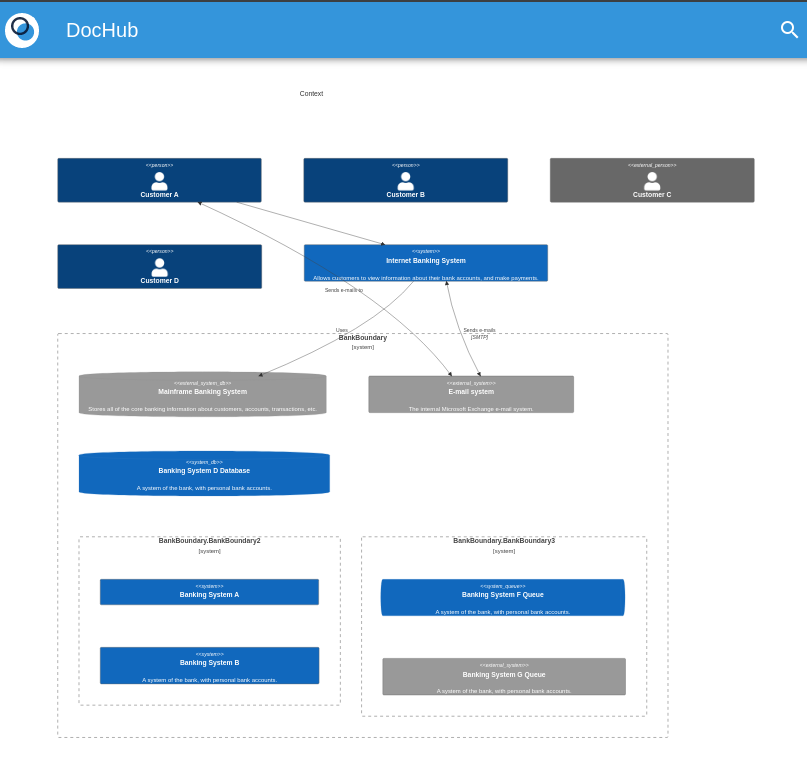
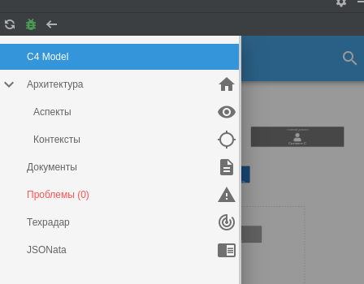

# Пример создания пользовательской метамодели C4 Model

**Цель примера:** Познакомить с возможностями создания пользовательской метамодели
в инструменте управления архитектурой [DocHub](https://dochub.info).

Пример является адаптацией [примера](https://mermaid-js.github.io/mermaid/#/c4c) 
с официального сайта Mermaid.

# Суть примера
DocHub позволяет создавать кастомные метамодели для описания архитектуры в том виде, 
которое требуется в конкретной прикладной области.

В базовый функционал DocHub не входит поддержка нотации C4 Model. Данный пример демонстрирует
как пользователь может реализовать эту поддержку самостоятельно.

Пример участка кода:
```yaml
# Описываем L1 Context в нотации C4 Model
c4model:
  # ******************************************************
  #                      Клиенты
  # ******************************************************
  customerA:
    title: Customer A
    entity: Person
    links:
      - id: SystemAA
        direction: ->
...
  # ******************************************************
  #                      Системы
  # ******************************************************
  SystemAA:
    title: Internet Banking System
    description: Allows customers to view information about their bank accounts, and make payments.
    entity: System
    links:
      - id: SystemE
        direction: ->
        title: Uses
      - id: SystemC
        direction: <->
        title: Sends e-mails
        description: SMTP
...
```

Результат:



## Файловая структура примера
* components - данные архитектуры для рендеринга
  * L1.yaml - компоненты уровня L1 C4 Model
  * L2.yaml - компоненты уровня L2 C4 Model
  * L3.yaml - компоненты уровня L3 C4 Model
  * root.yaml - корневой манифест данных архитектуры
* entities - матемодель;
  * templates - шаблоны, используемые для рендеринга диаграмм
    * context.mmd - Mermaid шаблон
  * c4model.yaml - манифест пользовательской сущности C4Model
  * root.yaml - корневой манифест метамодели
* images - картинки для настоящей документаии
* dochub.yaml - корневой манифест примера

## Использование
В меню плагина DocHub выберите пункт "C4 Model"



Кликните на диаграмме по компоненту "Internet Banking System". 
Вы "провалитесь" в него на уровень L2 в нотации C4 Model. 
Далее кликните по компоненту "API Application".

Вносите изменения в данные архитектуры в файлах аталога [components/](./components). 
Наблюдайте изменения в рендеринге плагина DocHub.

## Задания для практики
* Опишите компоненты для контейнера SystemAA.spa в файле [components/L3.yaml](./components/L3.yaml);
* Опишите контейнеры системы SystemE в файле [components/L2.yaml](./components/L2.yaml)
  и компоненты к ним в файле [components/L3.yaml](./components/L3.yaml);
* Измените шаблон рендеринга с Mermaid на PlantUML;
* Добавьте новое обязательное поле в метамодель [c4model](./entities/c4model.yaml) для уровня L1;
* Реализйте поддержку L4 C4Model в метамодели.