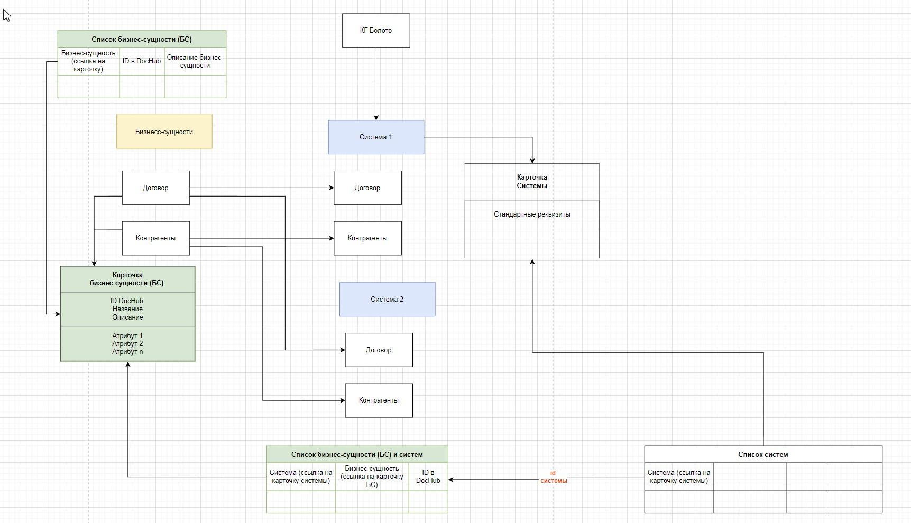
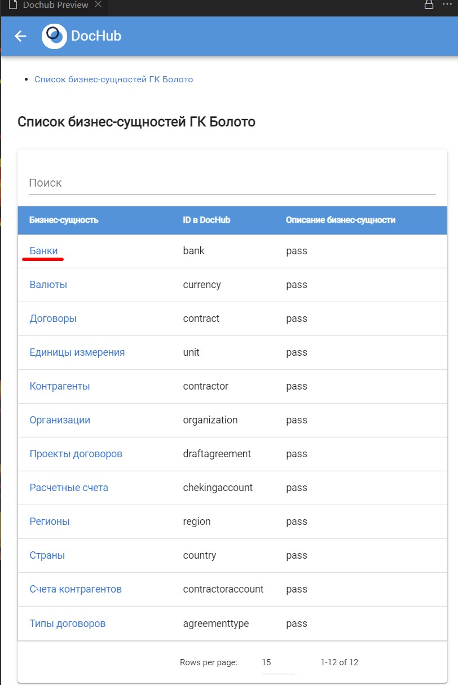
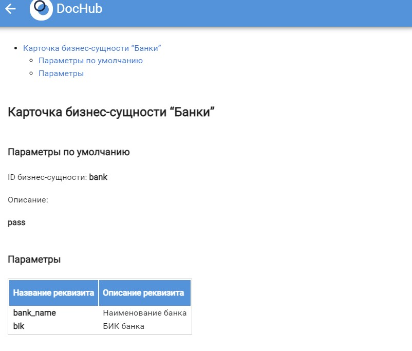
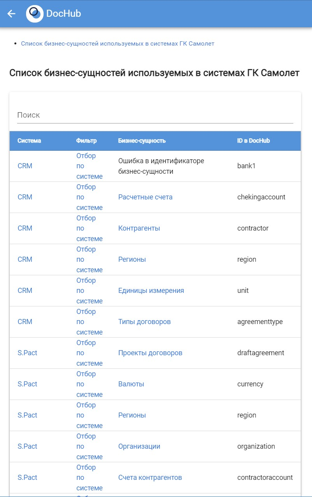
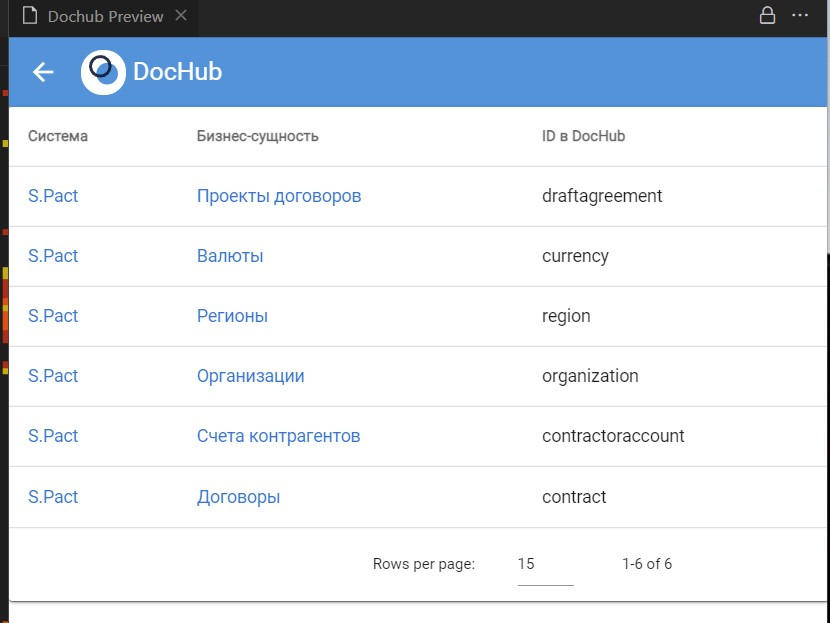
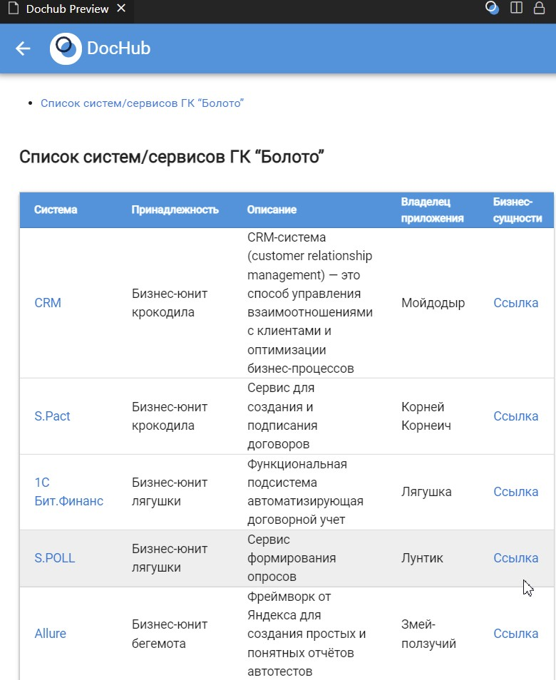

# Пример управления бизнес-сущностями

**Цель примера:** Показать возможности по управлению бизнес-сущностями
в инструменте управления архитектурой [DocHub](https://dochub.info).

Помимо заявленной цели пример содержит еще несколько интересных реализаций. Например, отчет показывающий список систем/сервисов с реализацией передачи параметра в другой отчет для установки значения фильтра.

# Суть примера
Стояла реальная бизнес-задача показать в каких системах используются те или иные бизнес-сущности.

Вторая задача определилась по ходу реализации. Оказалось что в компании нет процесса управления бизнес-сущностями на логическом уровне, что приводит к тому, что в разных сервисах одну и туже бизнес-сущность логически и физически реализуют по разному. Начиная с того что реквизиты называются по разному, могут иметь разный физический смысл и заканчивая тем, что часть сущностей с одинаковым названием физически означают разные вещи. Все это вызывает большие проблемы с интеграцией между сервисами.

Поэтому было решено на базе DocHub реализовать управление логическим уровнем бизнес-сущностей и создать эталонный список бизнес-сущностей, который команды смогут использовать в качестве шаблона для создания физической реализации у себя в проектах.

## Логическое описание реализации и файловая структура примера
Для реализации был выбран вариант создания нового entity, который называется "business_entities". Физически business_entities было реализовано через 2 файла:
* business_entities/business_entities_model.yaml - в этом файле была описана сама модель, реализован вывод в меню и несколько вариантов визуализации в виде отчетов. Все запросы переиспользуемые, так как они были добавлены в datasets/datasets.yaml
* business_entities/business_entities.yaml - в этом файле хранятся значения "business_entities"

Для реализации привязки бизнес-сущностей в системах/сервисах необходимо добавлять массив используемых бизнес-сущностей в раздел "business_entities":
```yaml
# Описываем L1 Context в нотации C4 Model
components:
  swamp.frog.spoll:
    title: S.POLL    # Название компоненты
    entity: system   # Сущность компонента из PlantUML (https://plantuml.com/ru/deployment-diagram)    
    short_description: Сервис формирования опросов
    description: Сервис формирования опросов
    business_owners:
      - Пиявки
    application_owner: Лунтик    
    critical_level: business_operational #administrative/business_operational/business_critical/mission_critical
    system_category: business_app #channel_app/business_app/ext_business_app/it_app/ext_it_app        
    aspects:                # Аспекты, которе реализует компонент
      - hr
    business_entities:      
      - bank
      - currency
      - region
      - chekingaccount
      - contractoraccount
      - contract
    links:
    # Интеграции между системами разных БЮ      
    - id: swamp.frog.1cbit_finance
      direction: <--
    - id: swamp.crocodile.crm
      direction: <--
    - id: swamp.crocodile.spact
      direction: <--

```

Также было разработано несколько отчетов:
* business_entities/business_entity_card.md - это карточка бизнес-сущности. Если добавить реквизиты к сущности, то в карточке они тоже будут выводиться. Для примера можно сформировать карточу бизнес-сущности "bank".
* business_entities/business_entities_list.md - это список всех бизнес-сущностей с возможностью перехода в карточку конкретной бизнес-сущности.
* business_entities/business_entities_in_systems.md - это список показывающий список бизнес-сущностей используемых в каждой системе. В этом отчете реализован пример установки фильтра по конкретной системе. Также реализована возможность сортировки практически по всем полям.
* systems_table.md - этот отчет выводит список систем, но также к нему была добавлена ссылка для возможности выводить отфильтрованный по системе список бизнес-сущностей.




## Использование
В меню плагина DocHub выберите пункт Документы/Моё болото. В меню вы увидите ссылки на 3 отчета.


1. Выберите пункт "1. Бизнес-сущности":



 Нажмите на ссылку "Банки" и перейдите в карточку бизнес-сущности:

 

2. Выберите пункт "2.  Список бизнес-сущностей в системах":

 

 Так как в системе CRM указан ошибочный идентификатор, то в колонке "Бизнес-сущность" для этого идентификатора указана ошибка "Ошибка в идентификаторе бизнес-сущности".

 При нажатии на заголовок таблицы "Бизнес-сущность" вы можете отсортировать список по имени бизнес-сущности и посмотреть в каких системах используется та или иная бизнес-сущность.

 Нажав ссылку "Отбор по системе" можно отфильтровать список по конкретной системе:

 

3. Выберите пункт "3. Список систем":



В колонке "Бизнес-сущности" нажмите "Ссылка". В результате выведется список бизнес-сущностей отфильтрованный по выбранной системе, аналогично пункту 2 этого раздела.

## Задания для практики
* Разберитесь со структурой примера, особе внимание обратите на алгоритмы формирования запросов. Если что-то не понятно, то можно почитать [документацию по JSONata](http://docs.jsonata.org/overview.html);
* Попробуйте реализовать какой-нибудь свой вариант отчета переиспользовав один из запросов описанных datasets/datasets.yaml.