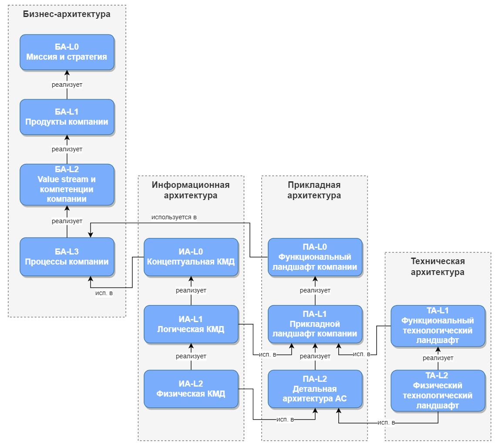
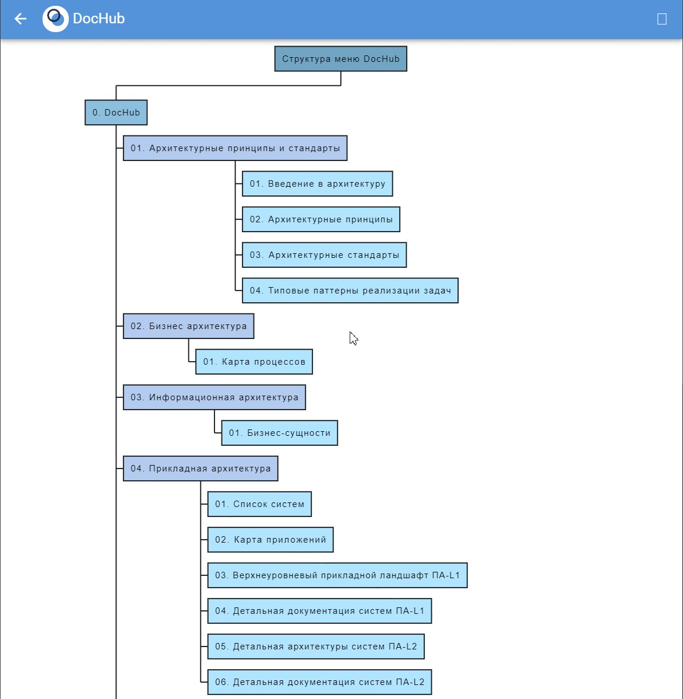
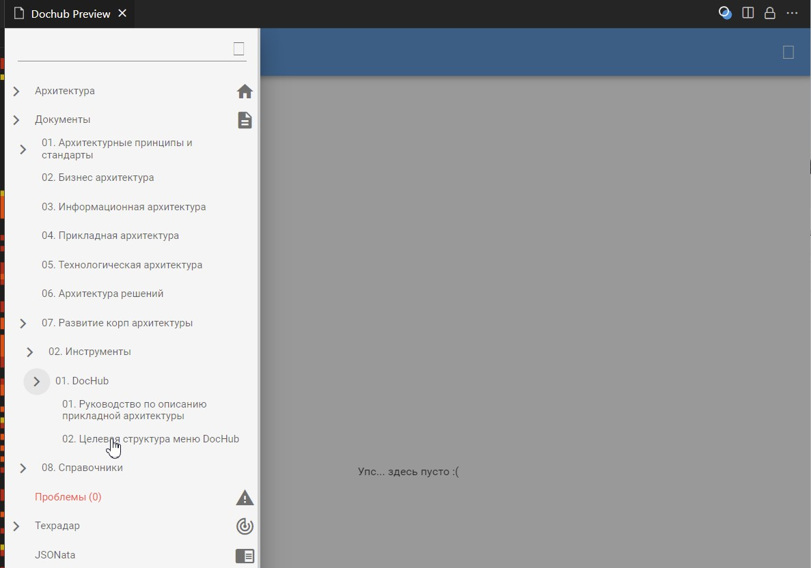
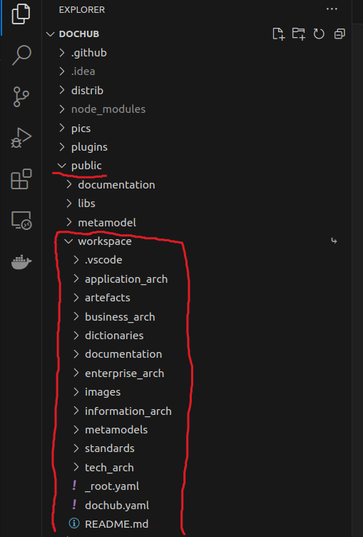
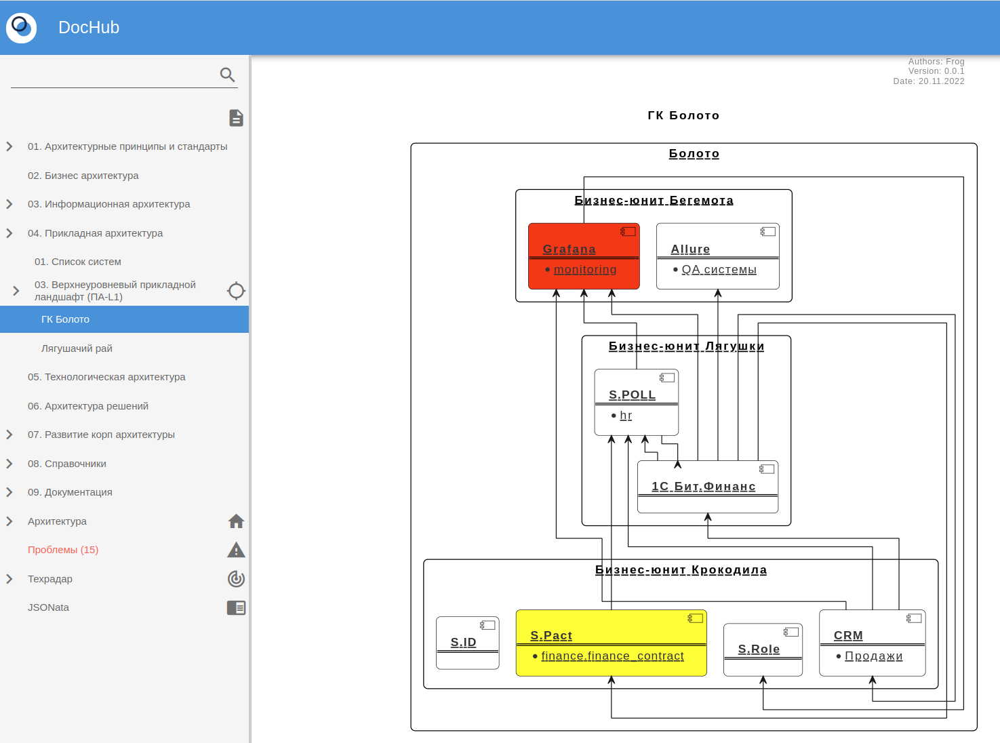
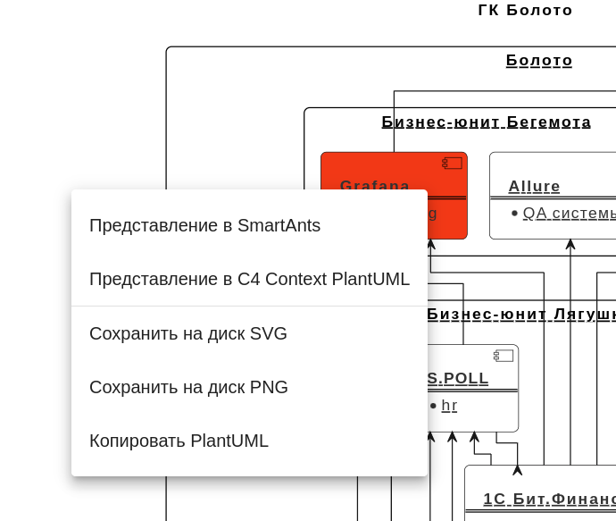

# Пример структуры репозитория для описания архитектуры v 2.0

**Цели примера:**
1. Снизить порог вхождения в DocHub за счет внедрения типовых шаблонов структуры репозитория и меню DocHub для управления корпоративной архитектурой.
2. Показать пример переноса дефолтной метамодели к себе в репозиторий
3. Показать возможность расширения дефолтных контекстов (plantuml,smartants) на примере реализации [с4 модели](https://github.com/plantuml-stdlib/C4-PlantUML)
4. Показать возможность расширения дефолтного контекста plantuml - реализована возможность подкрашивать системы различными цветами

# Благодарность
Как говорит, один мой хороший друг, дабы не перебивать копирайты, хочу сказать отдельное спасибо Максиму Муратову (https://t.me/maxim_muratov). Собственно Максим и реализовал с4 контекст и помог реализовать возможность красить контексты, а я "просто разместил объяву".

# Отличия от предыдущей версии
* Основным отличием от предыдущей версии является то, что в этой версии управление метамоделями выделено в отдельную папку **metamodels** с целью разделения архитектурных данных и структуры метамоделей. Планируется, что будет разработано два пайплайна. В случае изменения архитектурных данных, эти данные сразу будет ехать на прод, предварительно проверяя наличие ошибок в валидаторе. В случае изменения метамодели, будет проводиться ревью изменений, а только потом специально обученный человек завезет изменения в прод.
* Второе отличие заключается в том, что пример стал более функциональным. В него было внесено множество реально работающих алгоритмов.

# Суть примера
Существует множество различных подходов к описанию архитектуры компании. В нашей компании была выбрана методология TOGAF. При этом мы не пытаемся внедрить классическую методологию TOGAF, мы используем комбинированный подход, выбирая только те инструменты, которые закрывают наиболее критичные риски компании.

Согласно методологии TOGAF архитектура предприятия делится на 4 домена:

1. Бизнес-архитектура - описание бизнес-процессов компании
2. Информационная архитектура - описание архитектуры данных
3. Прикладная архитектура - описание архитектуры программных продуктов (системы, сервисы, приложения и т.д.)
4. Технологическая архитектура - описание архитектуры инфраструктуры



Вся структура примера разработана под выбранную методологию с учетом нашего видения. В общем случае в данном репозитории мы ведем прикладную архитектуру уровня ПА-L1, но если у системы нет своего репозитория, либо у архитектора несколько систем, то он может управлять в этом репозитории и уровнем ПА-L2.

## Файловая структура примера
* **application_arch** - в этой папке хранятся все данные, связанные с прикладной архитектурой, кроме контекстов. Контексты мы вынесли в отдельную папку artefacts. Детально про artefacts можно почитать ниже.
    * **reports** - в этой папке хранятся различные отчеты по системам.
    * **systems** - в этой папке хранятся данные по системам. Каждую систему мы описываем в своём файле и имя файла всегда соответствует имени системы. Идентификатор системы в общем случае представляет из себя доменное имя в виде: `<имя компании>.<имя бизнес-юнита>.<имя системы>`. Если вдруг у системы нет своего репозитория, то в этом файле мы также описываем runtime компоненты этой системы, что позволяет хранить всю информацию по системе в одном месте.    
    * **aspects** - в этой папке хранится список аспектов системы.
    * **users** - в этой папке хранится список пользователей системы.
* **artefacts** - в этой папке хранятся все артефакты по системам, например контексты мы храним в такой структуре: `./artefacts/<имя бизнес-юнита>/<имя контекста>`. Также здесь мы храним различные схемы по системам.
    * **common** - в этой папке хранится общий контекст ГК Болото.
    * **frog_paradise** - в этой папке хранится контекст БЮ Лягушачий рай.
* **business_arch** - в этой папке хранятся все данные, связанные с бизнес-архитектурой. На текущий момент мы не ведем в DocHub бизнес-архитектуру. Возможно, сюда будем класть архитектурные скетчи, когда Рома закончит встраивать в DocHub https://excalidraw.com/
* **dictionaries** - вспомогательная папка для хранения справочной информации. Например, при заполнении системы встал вопрос по её статусам, и чтобы не дублировать каждый раз всю информацию по статусу мы сделали справочник статусов. В результате в системе мы используем только идентификатор статуса, а если нам нужна полная информация, то получаем её при помощи функции $lookup внутри запроса.
* **documentation** - в этой папке хранится общая документация. Мы пытались её размещать в различных папках, но в конце концов приняли решение сделать для неё отдельное место.
    * **glossary** - в этой папке хранится глоссарий ГК Болото.
    * **useful_links** - в этой папке хранятся полезные линки на внешние ресурсы. Это может быть Confluence, различные обучающие видео на YouTube и т.д.
    * **images** - в этой папке хранятся картинки для документации.
* **enterprise_arch** - это папка корпоративных архитекторов, сюда мы помещаем всю информацию, которая связана с развитием архитектуры в компании.
    * **adr** - в этой папке хранится реестр архитектурных решений
    * **processes** - в этой папке мы храним документацию по различным архитектурным процессам
    * **tools** - в этой папке хранится документация по инструментам архитектуры
        * **dochub** - в этой папке хранится документация по DocHub
    * **welcome** - в этой папке хранится документация, которая выводится при открытии DocHub (welcome page) 
* **images** - картинки для настоящей документации
* **information_arch** - в этой папке хранятся все данные, связанные с информационной архитектурой. На текущий момент мы в начале пути и сделали пока только прототип по управлению бизнес-сущностями на логическом уровне.
    * **business_entities** - в этой папке хранятся данные по бизнес-сущностям. Сама модель переехала в папку metamodels.
* **metamodels** - в этой папке хранятся все метамодели, а также дополнительные наборы данных и инструментов необходимых для разработки метaмоделей и их валидации.
    * **custom** - в этой папке хранится описание всех пользовательских матамоделей.
        * **business_entities** - в этой папке хранится описание модели по управлению бизнес-сущностями на логическом уровне.
        * **dictionaries** - в этой папке хранится матамодель описывающая структуру справочников.
        * **dochub_menu** - в этой папке хранится матамодель описывающая целевую структуру меню.
    * **datasets** - в этой папке хранятся все общие запросы (datasets).
    * **default** -  в эту папку была перенесена метамодель DocHub заданная по умолчанию. Также  папке хранятся все инструменты для расширения дефолтных метамоделей DocHub.
        * **entities** - в этой папке хранится метамодель DocHub заданная по умолчанию.
        * **rules** - в этой папке хранится матамодель штатных валидаторов ядра, а также кастомных расширений. В самой папке есть два вида примеров, это валидация через schema и валидация через проверку заполнения конкретных параметров. Пример использования для schema можно посмотреть [здесь](https://github.com/rpiontik/DocHubExamples/tree/main/src/validator_example).
    * **jsonata** - в этой папке хранятся общие функции. Пример использования можно посмотреть [здесь](https://github.com/rpiontik/DocHubExamples/blob/main/src/jsonata_query_examples/jsonata_query_example.md).
* **standards** - это одна из ключевых папок, где мы храним архитектурные принципы и стандарты, которые обязательны к выполнению всеми командами
    * **arch_principles** - здесь у нас описаны архитектурные принципы и принципы информационной безопасности
    * **it_platforms** - здесь мы храним архитектурные стандарты по платформам, а также принятые нотации по кодированию
    * **patterns** - здесь мы описываем различные паттерны, которые могут использовать наши команды. В примере есть пример реализации одного из таких паттернов.
* **tech_arch** - в этой папке хранятся все данные, связанные с технологической архитектурой. Сейчас мы пока реализовали процесс управления развертыванием систем. Пример использования можно посмотреть [здесь](https://github.com/rpiontik/DocHubExamples/tree/main/src/deployment_units_management)
* **_root.yaml** - корневой файл для импорта
* **dochub.yaml** - корневой файл DocHub
* **README.md** - текущая документация

## Правила импорта yaml файлов
Импорт всех файлов делается только через `_root.yaml`. Это означает что при создании любой папки всегда нужно сначала добавлять `_root.yaml`, а уже внутри подключать файлы.
Такой подход позволяет очень быстро переструктурировать папки репозитория, а также избегать множественного импорта при подключении репозитория как подмодуль.

## Пример целевого меню
Ниже наша версия такого меню:



Найти реализованный пример на базе entity можно здесь:



## Использование
Скачайте себе пример и "потыкайте" каждый пункт меню, думаю найдете что-нибудь интересное :-).

# Дополнения к примеру

## Перенос метамодели DocHub к себе в репозиторий
Так как у нас не получилось в файле .env задать относительный путь к репозиторию, а копировать репозиторий не хотелось, то мы решили эту проблему создав символьную ссылку на наш репозиторий.
1. Перейдите в папку `cd dochub/public`
2. Выполните команду `ln -s ../../<путь к вашему репозиторию> workspace`
3. Проверьте, что после выполнения команды у вас появился каталог `workspace` в папке `public`

4. Настройте файл `.env` согласно примера `./repository_structure_example/enterprise_arch/tools/dochub/.env`
5. Запустите веб версию DocHub и проверьте что все работает

## Контекст в формате c4 model

Для реализации контекст в формате c4 model было сделано несколько изменений в метамодели DocHub:

1. В каталог `./repository_structure_example/metamodels/default/entities/contexts/templates/` был добавлен шаблон `context.puml`. По факту это адаптированный файл из репозитория https://github.com/plantuml-stdlib/C4-PlantUML
2. В каталог `./repository_structure_example/metamodels/default/entities/contexts/` был добавлен файл `c4_context.yaml` реализующий логику формирования формирования System Context diagram ([в терминах с4](https://c4model.com/))
3. В файл `./repository_structure_example/metamodels/default/entities/contexts/base.yaml` был добавлен вариант по умолчанию для отображения контекстов c4 `defaultPresentation: c4_context # plantuml / smartants / c4_context`.

Пример


**Нюансы**

Если вы используете общественный сервер PlantUML, то вы не сможете отобразить контекст в формате c4, так как схемы получаются большие, а у общественного сервера есть ограничения по объёму запросов. Поэтом для экспериментов я рекомендую поднять свой локальный сервер. Для этого просто скопируйте себе в отдельную папку файл `./repository_structure_example/enterprise_arch/tools/dochub/docker-compose.yml` и выполните команду `docker compose up` и по 9000 порту у вас будет доступен локальный сервер PlantUML. Именно этот сервер указан в примере файла `.env.


## Как раскрасить системы в контексте
Иногда хочется раскрашивать системы в контексте в зависимости от каких либо параметров системы. Данный пример показывает как это можно реализовать.

Для упрощения примера в существующую метамодель системы был добавлен параметр `color`. Реализацию можно посмотреть в файле `./repository_structure_example/application_arch/systems/spact.yaml`.
Далее параметр color был добавлен в файл формирования стандартного контекста в формате plantuml `./repository_structure_example/metamodels/default/entities/contexts/plantuml.yaml`
```
$result := "$Entity(\"" 
    & $entity 
    & "\", \""
    & "[[/architect/components/" & $domain & " " & $component.title & "]]"
    & "\", " 
    & $domain
    & ", ,"& ($exists($component.color) ? ("#" & $component.color) : ("")) &")\n";
```
Последним действием был изменен шаблон `./repository_structure_example/metamodels/default/entities/contexts/templates/template.puml`. Внутри шаблона был доработана процедура $Entity.
```
!unquoted procedure $Entity($entity, $ACName, $id, $ACType, $Colored = "")
    $join_start()
    !if ($entity == component)
        component $id $Colored [
        <b>$ACName</b>
        ====
    !elseif ($entity == system)
        component $id $Colored [
            <b>$ACName</b>
            ====
    !elseif ($entity == actor || $entity == person)
        actor $id [
        ..===$ACName..
        ]
    !else
        $entity $id [
            <b>$ACName</b>
            ====
    !endif
!endprocedure
```
После нескольких манипуляций мы получили раскрашенный контекст:


Не забываем, что контексты в новой метамодели можно переключать по правой кнопке мыши:

