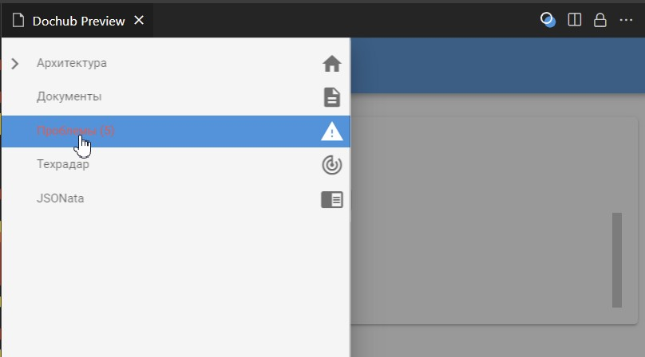
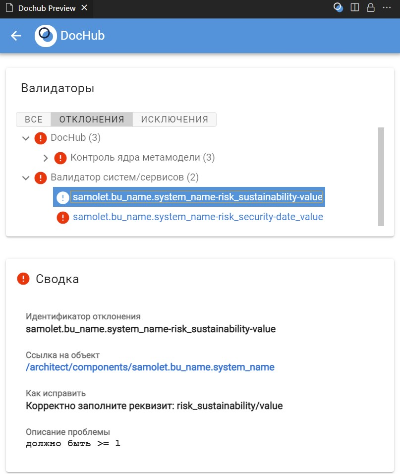

# Простой пример валидации сущностей в DocHub с выводом информации в меню

**Цель примера:** На простом примере показать возможности валидатора, с выводом информации в меню DocHub.

# Суть примера
В процессе работы стало понятно, что нам не хватает реквизитов для описания типовых систем/сервисов. Например, бизнес выразил желание делать оценку рисков. Поэтому типовая карточка систем была дополнена набором различных реквизитов описывающие риски системы/сервисов.

Так как планируется, что данные реквизиты буду заполнять различные сотрудники, то мы решили сделать валидатор для проверки этих данных и вывести его в меню DocHub, для того чтобы было удобней смотреть.

## Файловая структура примера
* system_template.yaml - пример системы/сервиса с расширенным набором полей 
* system_validator.yaml - валидатор, который проверяет нужный набор реквизитов и выводит информацию о результатах валидации в меню DocHub
* images - картинки для настоящей документации
* dochub.yaml - корневой манифест примера

## Использование
В меню плагина DocHub выберите пункт "Проблемы"

Разверните пункт "Валидатор систем/сервисов" и наслаждайтесь результатами ошибок (для этого я оставил парочку).

## Задания для практики
* Исправьте ошибки, которые были добавлены в тестовый пример
* Добавьте новых реквизитов и добавьте их в валидатор
* Введите ошибочные значения для предыдущего пункта и посмотрите результаты