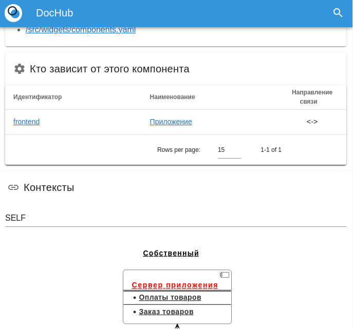
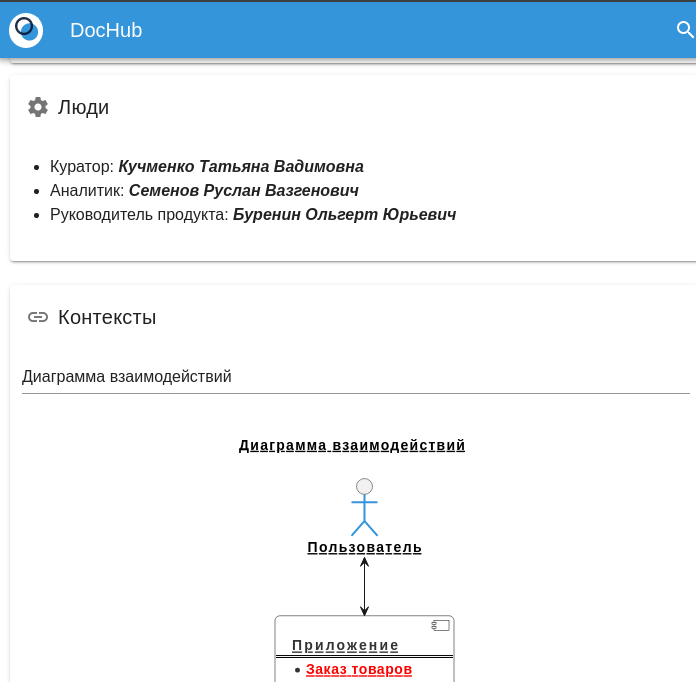
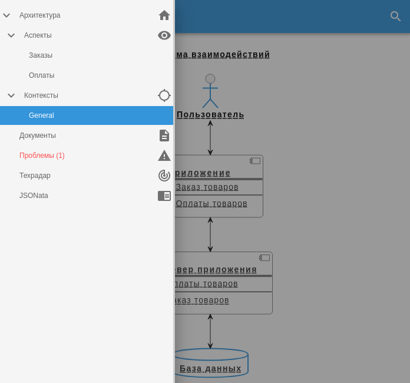

# Пример встраивания виджетов в представления стандартных сущностей 

**Цель примера:** Познакомить с возможностями расширения представлений 
стандартных сущностей.

# Суть примера
Создаются виджеты, которые встраиваются в представления Aspects и Components.

В components встраиваивается виджет, демонстрирующий, кто зависит
от данного компонента:

В aspects встраивается виджет, демонстрирующий, кто отвечает за
реализацию данного архитектурного аспекта.

## Файловая структура примера
* entities - расширения сущностей
  * templates - шаблоны виджетов
    * people.md - Markdown шаблон для виджета сущности aspects
  * aspect.yaml - расширение сущности aspects
  * components.yaml - расширение сущности components
  * root.yaml - корневой манифест пакета расширения сущностей
* images - картинки для настоящей документации
* aspects.yaml - архитектурные аспекты
* components.yaml - архитектурные компоненты
* contexts.yaml - архитектурные контексты
* dochub.yaml - корневой манифест примера

## Использование
В меню плагина DocHub выберите "Архитектура" -> "Контексты" -> "General".
В открывшемся контексте кликните по архитектурному компоненту или аспекту.
Найдите в карточке встроенный виджет.

Вносите изменения в код архитектуры в файлах каталога 
[components.yaml](./components.yaml) и [aspects.yaml](./aspects.yaml). 
Наблюдайте изменения в рендеринге карточек объектов.

## Задания для практики
* Создайте дополнительные компоненты, которые будут связаны с компонентом backend.
  Проверьте, что в карточке компонента backend появилась информация об 
  этих зависимостях;
* Добавьте новое поле в шаблон виджета aspects в [расширении](./entities/aspects.yaml). 
  Добейтесь корректного вывода значания этого поля в карточке аспектов при заполнении 
  в коде архитектуры.
* Измените виджет вывода зависимостей внешних компонентов в расширении [components](./entities/components.yaml)
  так, чтобы зависомости наглядно отображались в виде диаграммы.
